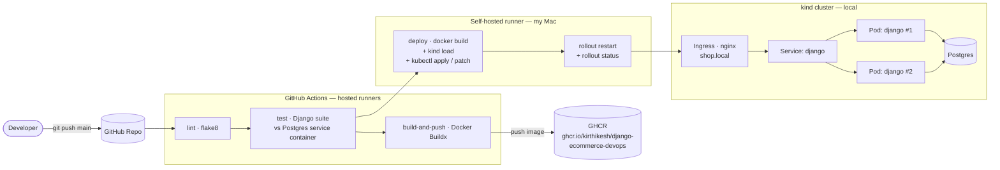

# django-ecommerce-devops

<p>
  
  
  
  
  
  
  
</p>

A full-featured e-commerce site built with Django, containerized with Docker, deployed to Kubernetes, and shipped through a self-hosted GitHub Actions CI/CD pipeline — end to end, on a single machine.

---

## Architecture



**Flow:** a push to `main` runs `lint` → `test` → `build-and-push` (built and pushed to GHCR by GitHub-hosted runners), then a **self-hosted runner on my own Mac** — because that's where the local `kind` cluster actually lives — builds the same image, loads it into the cluster, applies the manifests, and rolls out. Fully automatic on every push; no manual `kubectl apply` after the cluster is first bootstrapped.

---

## Features

| Area | What it does |
|---|---|
| **Catalog** | Categories, products, search and filtering (name, category, price range), sorting, pagination |
| **Cart** | Session-based cart — add / update / remove, works for guests, survives login |
| **Checkout** | Mock payment gateway (no real charges, no API keys) inside a DB transaction — stock is decremented atomically and oversell is blocked |
| **Accounts** | Custom user model, registration, login/logout, profile with shipping details |
| **Orders** | Order history and order detail pages for logged-in users |
| **Reviews** | Star ratings + comments per product, one review per user per product |
| **Admin** | Django admin for managing products, categories, orders and reviews |

## Tech stack

- **App:** Django 4.2, Gunicorn, Whitenoise (static files), Postgres 16 (SQLite fallback for zero-dependency local dev)
- **Container:** Docker (`python:3.11-slim`, non-root user, static assets collected at build time)
- **Orchestration:** Kubernetes manifests for a local `kind` cluster — Namespace, ConfigMap, Secret, Deployment (with an `initContainer` running migrations), Service, Ingress
- **CI/CD:** GitHub Actions — lint, test, build & push to GHCR, and a self-hosted-runner deploy job

## Project layout

```
core/                Django project settings, urls, wsgi/asgi
apps/
  accounts/          custom user model, auth views
  products/          catalog, search/filter, admin
  cart/              session-based cart
  orders/            checkout, mock payments, order history
  reviews/           product reviews
templates/           Django templates
static/              CSS
k8s/                 Kubernetes manifests
.github/workflows/   ci-cd.yml — lint → test → build-and-push → deploy
Dockerfile
docker-compose.yml
```

---

## Getting started

### 1. Local dev, no Docker

```bash
python3 -m venv venv
source venv/bin/activate
pip install -r requirements-dev.txt
cp .env.example .env
python manage.py migrate
python manage.py createsuperuser
python manage.py runserver
```

Without `POSTGRES_DB` set, the app falls back to SQLite automatically — zero external services required.

### 2. Docker Compose

```bash
cp .env.example .env
docker compose up --build
```

Starts Postgres and the Django app (via Gunicorn) at **http://localhost:8000**. Migrations run automatically on container start.

### 3. Kubernetes (kind)

Bootstrap the cluster once:

```bash
kind create cluster --name ecommerce
# install an ingress controller if the cluster doesn't have one, e.g. ingress-nginx's kind manifest
cp k8s/secret.example.yaml k8s/secret.yaml   # fill in real values — it's gitignored, never commit it
kubectl apply -f k8s/namespace.yaml
kubectl apply -f k8s/configmap.yaml
kubectl apply -f k8s/secret.yaml
kubectl apply -f k8s/postgres.yaml
kubectl apply -f k8s/django.yaml
kubectl apply -f k8s/ingress.yaml
```

Add `127.0.0.1 shop.local` to `/etc/hosts`, port-forward or set up your ingress controller's LoadBalancer, then check:

```bash
kubectl -n ecommerce get pods
```

After that first bootstrap, every `git push` to `main` builds, loads and rolls out the new image automatically — see **CI/CD** below.

### Environment variables (`.env`)

| Variable | Purpose | Default |
|---|---|---|
| `DJANGO_SECRET_KEY` | Django secret key | — |
| `DJANGO_DEBUG` | `True`/`False` | `True` |
| `DJANGO_ALLOWED_HOSTS` | Comma-separated allowed hosts | `localhost,127.0.0.1` |
| `POSTGRES_DB` / `POSTGRES_USER` / `POSTGRES_PASSWORD` | Database credentials | `ecommerce` / `ecommerce` / — |
| `POSTGRES_HOST` / `POSTGRES_PORT` | Database connection | `db` / `5432` |

---

## CI/CD pipeline

`.github/workflows/ci-cd.yml` runs on every push and pull request to `main`:

1. **lint** — `flake8` across `apps/` and `core/`
2. **test** — full Django test suite against a real Postgres service container
3. **build-and-push** — Docker Buildx builds the image and pushes `latest` + the commit SHA to `ghcr.io/kirthikesh/django-ecommerce-devops` (push-to-`main` only)
4. **deploy** — runs on a **self-hosted runner registered on my own Mac** (GitHub-hosted runners have no network path to a cluster living on my laptop). It builds the image locally, loads it into the `kind` cluster with `kind load docker-image`, applies the `k8s/` manifests, patches the Deployment to pin the freshly-loaded local image, then runs `kubectl rollout restart` and waits on `kubectl rollout status` before the job is allowed to succeed

The runner itself is installed as a persistent background service (`svc.sh install && svc.sh start`), so it's always listening — no manual step needed once it's running.

## Payments

Checkout uses a small mock gateway (`apps/orders/payments.py`) that mimics test-mode providers like Stripe: any card number succeeds except one ending in `0000`, which simulates a decline. No external payment API or credentials are required. Swap it for a real integration behind the same `charge()` interface for production.

## Tests

```bash
python manage.py test
```

Covers catalog pagination, cart/session behaviour (including cart-merge-on-login), checkout stock decrement, and oversell protection.

---

## License

MIT
